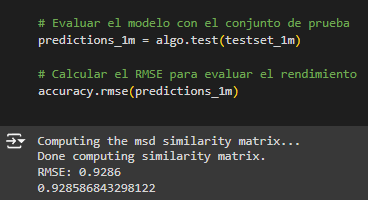
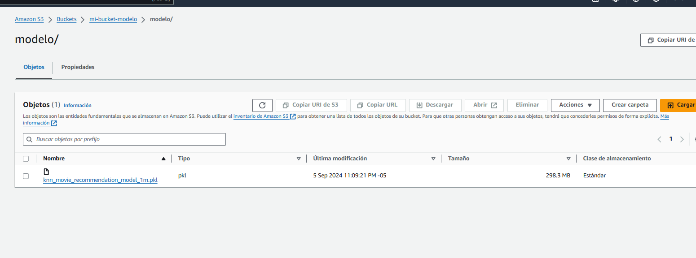
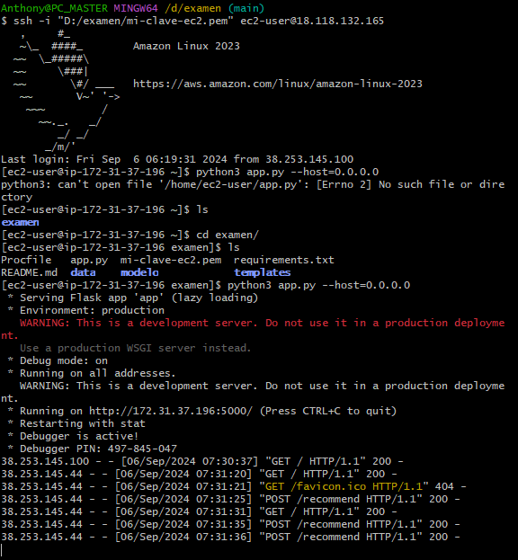
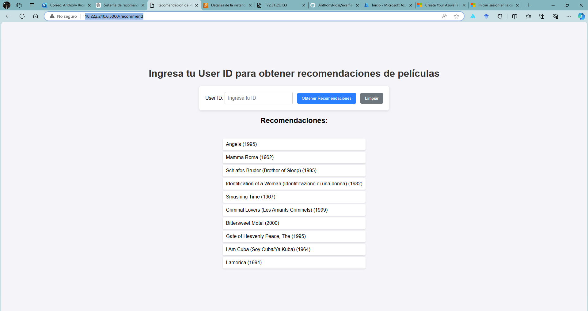

# Sistema de Recomendación de Películas

Este repositorio contiene la implementación de un sistema de recomendación de películas utilizando filtrado colaborativo. El sistema está basado en el dataset **MovieLens** y fue desarrollado utilizando Python, con un enfoque en el filtrado colaborativo basado en interacciones entre usuarios y películas. El modelo se construyó usando la librería `surprise`, y el sistema fue desplegado en **AWS EC2** con una API construida en **Flask**.

## Estructura del Proyecto
- **Exploración y Preparación de Datos:**
    - Se exploró y limpió el dataset proporcionado por MovieLens. El dataset incluye las calificaciones que los usuarios dieron a una amplia variedad de películas.
    - Se realizó un análisis exploratorio de datos (EDA) en un cuaderno de Jupyter alojado en Google Colab.
    - Se manejaron valores faltantes y se prepararon los datos para el modelado.

- **Implementación del Modelo:**
    - Se implementó un modelo de filtrado colaborativo utilizando **K-Nearest Neighbors (KNN)** con la librería `surprise`.
    - El modelo fue entrenado con el dataset **MovieLens 1M** para sugerir las 10 mejores películas a un usuario dado, basándose en sus calificaciones anteriores.

El mejor modelo fue el de 1m


- **Despliegue:**
    - El sistema de recomendación fue desplegado como una **API REST** utilizando Flask.
    - La API recibe un `user_id` como entrada y devuelve las 10 mejores recomendaciones de películas para ese usuario.

## Uso

### Si deseas usarlo localmente
Para ejecutar el sistema localmente, sigue estos pasos:

1. Clona el repositorio:
    ```bash
    git clone https://github.com/AnthonyRioss/examen.git
    ```

2. Instala las dependencias necesarias:
    ```bash
    pip install -r requirements.txt
    ```

3. Ejecuta la aplicación Flask:
    ```bash
    python app.py
    ```

4. Accede a la API a través de `http://127.0.0.1:5000/`.

### Cuaderno de Google Colab
El entrenamiento del modelo y el análisis exploratorio de datos (EDA) se realizaron en **Google Colab** porque la librería surprise no me dejaba instalarla en mi pc y daba muchos problemas.
El link es: https://colab.research.google.com/drive/1t2oA7uIjmHqGswyQbmnQbibUFoKcWMkz?usp=sharing
Puedes abrir este cuaderno en Colab para ver el proceso detallado de exploración de datos, preprocesamiento y entrenamiento del modelo.

### Despliegue en AWS

Se Añadió el modelo a un bucket en AWS debido al tamaño del modelo, al ser mayor 200mb github no acepta ese tamaño.

 
El sistema fue desplegado en una instancia de **AWS EC2**. Para acceder a la API de recomendaciones, puedes hacer una solicitud GET a:

http://18.222.240.6:5000/recommend





## Requisitos

El proyecto requiere las siguientes librerías de Python:
- `Flask>=2.0`
- `numpy>=1.22.4`
- `pandas>=1.3.0`
- `scikit-surprise>=1.1.1`
- `joblib>=1.0.0`
- `scipy>=1.6.0`

Todas las dependencias están listadas en el archivo `requirements.txt` y pueden instalarse con el siguiente comando:
```bash
pip install -r requirements.txt
```
## Observaciones
Por temas de tiempo estoy probando la funcionalidad de servicios como vertex IA 


Además al ser una cuenta gratis de aws, el servidor suele caerse y es inestable

✅ Checklist de Entrega
Por favor, marca con una "X" los ítems que has completado:
1. Exploración y Preparación de Datos ✅  (colab)
2. Desarrollo del Sistema de Recomendación ✅  (colab)
3. Documentación y Entrega ✅ 
✨ Puntos Extra (Opcional) 
1. API RESTful: Implementa un API utilizando Flask o FastAPI que permita consultar
recomendaciones.  ✅ 
2. Despliegue en la Nube: Despliega el sistema en AWS, Google Cloud, o Azure. ✅  (AWS)
3. Pruebas de Rendimiento: Evalúa el rendimiento comparando datasets de 
diferentes tamaños (por ejemplo, MovieLens 100k vs. 1M). ✅ (colab)
4. Uso de Herramientas Avanzadas: Implementa el modelo utilizando AWS
SageMaker, Azure Machine Learning, o Google AI Platform. (por el momento en desarrollo)